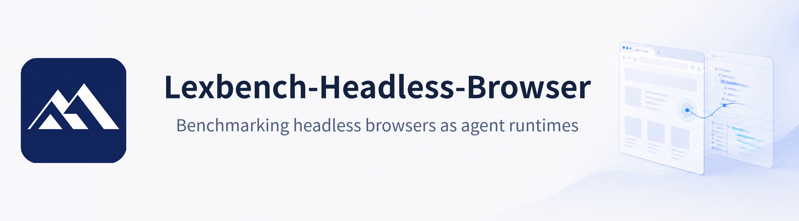
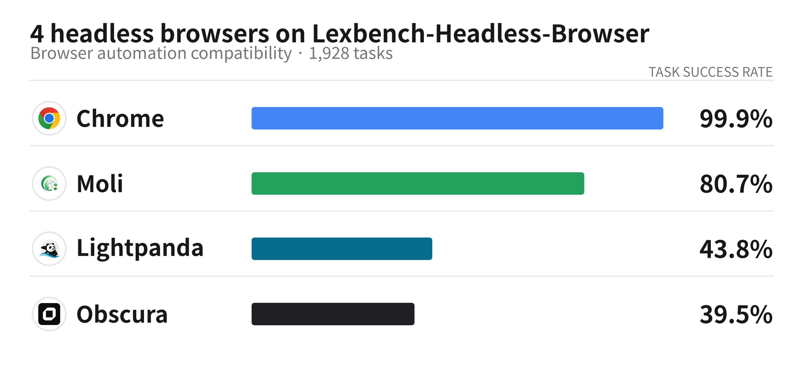
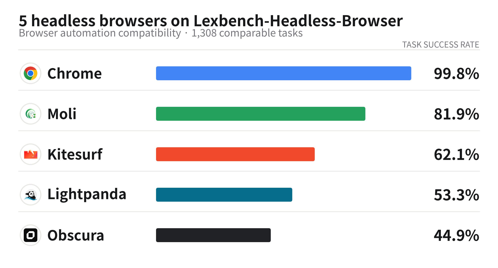
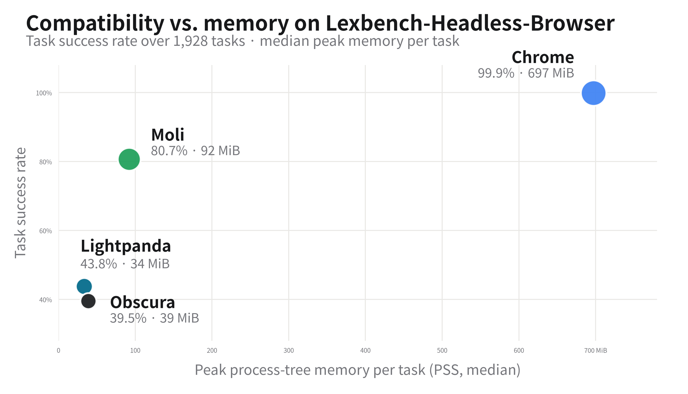

  

<h1 align="center">Lexbench-Headless-Browser</h1>

  
  

  <a href="README.md">English</a> · <a href="README.zh.md">中文</a>

  <picture>
    <source media="(prefers-color-scheme: dark)"
            srcset="https://img.shields.io/badge/The%20next%20users%20of%20the%20headless%20browser%20are%20agents.-3D74D9?style=for-the-badge">
    
  </picture>

<b>1,928 tasks · <a href="#benchmark-composition">13 browser automation tools including Playwright, Puppeteer and Selenium</a></b>

Agents are taking over the web chores that used to be done by hand: searching, comparing prices, filling forms, placing orders. The page is no longer rendered for a person to look at: the agent reads state, performs operations and collects results inside it, and the browser has become the agent's runtime.

An agent never touches the browser directly. A whole control chain sits in between: the tool layer, the driver, the control protocol, and only then the engine. That chain has no de facto standard, and different agent frameworks picked different control paths: [browser-use](https://github.com/browser-use/browser-use) speaks CDP through its own `cdp-use` client, [hermes-agent](https://github.com/nousresearch/hermes-agent) drives sessions through [agent-browser](https://github.com/vercel-labs/agent-browser), and Google's [chrome-devtools-mcp](https://github.com/ChromeDevTools/chrome-devtools-mcp) sits on Puppeteer. Whether an engine is usable is decided by every link on these paths holding up.

Meanwhile, a batch of new engines has appeared, among them [Moli](https://github.com/lexmount/moli), [Lightpanda](https://github.com/lightpanda-io/browser) and [Obscura](https://github.com/h4ckf0r0day/obscura). Their pitch is lightness, and their goal is to replace Chrome in agent workloads. For the replacement to hold, the drivers of the Chrome ecosystem must keep working when pointed at the new engine, and once the protocol connects, the page semantics seen through it must be right.

That premise has never had a systematic test. [WPT](https://web-platform-tests.org/) (web-platform-tests) is the cross-vendor suite for web-platform specifications and interoperability, and it does include tests for standardized automation protocols such as WebDriver, but its goal is not to verify that real client stacks like Playwright, Puppeteer, Selenium or agent-browser can drive a candidate engine end to end, and it offers no compatibility or resource comparison of those paths under one common standard. What engine projects publish about their own supported APIs cannot give a cross-engine, reproducible comparison either.

Lexbench-Headless-Browser turns that premise into something testable: every task starts from a real control path (raw CDP, or one of 13 pinned drivers) and walks the whole control chain, then checks whether the operation completed and whether the page semantics behind it came out right. The results also tell engine authors which interfaces they are missing and on which driver path. Chrome runs the same tasks as a reference column: it takes no part in the replacement comparison, confirms that the tasks themselves pass on a mature engine, and serves as the baseline for the resource comparison, answering how much memory and CPU each task saves once Chrome is swapped out.

## Results

  <picture>
    <source media="(prefers-color-scheme: dark)" srcset="docs/assets/four-engine-overview-dark.png">
    
  </picture>

| Engine | Version | Passed | Task success rate |
|:---|:---|---:|---:|
| [Chrome for Testing](https://googlechromelabs.github.io/chrome-for-testing/) | 151.0.7922.47 | 1,926 / 1,928 | **99.90%** |
| [Moli](https://github.com/lexmount/moli) | 0.1.1 | 1,556 / 1,928 | **80.71%** |
| [Lightpanda](https://github.com/lightpanda-io/browser) | 1.0.0-dev.321+b04c99a9 | 845 / 1,928 | **43.83%** |
| [Obscura](https://github.com/h4ckf0r0day/obscura) | 0.1.11 | 762 / 1,928 | **39.52%** |

<b>Five-engine results at a glance (with Kitesurf, on a 1,308-task comparable subset)</b>

  <picture>
    <source media="(prefers-color-scheme: dark)" srcset="docs/assets/five-engine-caliber-b-dark.png">
    
  </picture>

| Engine | Comparable subset (1,308 tasks) |
|:---|---:|
| [Chrome for Testing](https://googlechromelabs.github.io/chrome-for-testing/) | 1,306 / 1,308 · **99.85%** |
| [Moli](https://github.com/lexmount/moli) | 1,071 / 1,308 · **81.88%** |
| [Kitesurf](https://blog.cloudflare.com/kitesurf/) (remote) | 812 / 1,308 · **62.08%** |
| [Lightpanda](https://github.com/lightpanda-io/browser) | 697 / 1,308 · **53.29%** |
| [Obscura](https://github.com/h4ckf0r0day/obscura) | 587 / 1,308 · **44.88%** |

This comparison uses a subset of the same 1,928-task set: tasks whose failures cannot be attributed when the engine is a remote endpoint are removed, and the removal applies to all five engines alike; removing a task does not mean Kitesurf would pass it once a local binary ships. The subset definition and the full report are on the [`kitesurf-eval` branch](https://github.com/lexmount/Lexbench-Headless-Browser/blob/kitesurf-eval/README.md).

Run parameters: run id `four_engine_full_20260812`, bench tag `2026.08.02-v0_4.1`, seed `official20260709`, k=3, 23,136 result rows. A task counts as passed only when all three attempts pass. Each engine is scored on its own attempts (`--score-mode independent`); Chrome is the reference column. Full report: [docs/reports/four-engine-report-20260812.md](docs/reports/four-engine-report-20260812.md).

> [!NOTE]
> If you care about [Kitesurf](https://blog.cloudflare.com/kitesurf/), the agent-first cloud browser Cloudflare just launched, its evaluation lives on the [`kitesurf-eval`](https://github.com/lexmount/Lexbench-Headless-Browser/blob/kitesurf-eval/README.md) branch. Kitesurf currently exists only as a remote endpoint, with no binary digest and no resource measurement, and the five-engine results are published on that branch.

## Resource Cost

The lightweight engines' biggest selling point is low resource use, and whether the replacement case holds also depends on how much they actually save, so resources are measured with the same rigor as compatibility. The task set is `l1.raw_cdp` (375 tasks) plus L2's `l2.web_platform` subset (182 tasks), 557 in total; the resource round runs strictly serial (`--jobs 1`) so engines never compete for the machine. Every resource statistic is computed only on the task-attempt intersection that all four engines passed (1,045 attempts): comparing cost makes sense only when everyone finished the same work, and a task an engine failed never enters its resource account.

Because observing a process can itself distort the numbers, the measurement is a two-round A/B design: the same tasks run once with the profiler off as a baseline, then once with it on, and the two rounds are compared to quantify the disturbance of observing. Numbers are recorded only when that disturbance clears the calibration gate (`resource_comparison_eligible: true`).

  <picture>
    <source media="(prefers-color-scheme: dark)" srcset="docs/assets/efficiency-map-dark.png">
    
  </picture>

Median peak process-tree memory per task: Lightpanda 34 MiB, Obscura 39 MiB, Moli 92 MiB, Chrome 697 MiB. Median engine CPU time per task on the same set: 36 ms, 38 ms, 101 ms, 687 ms. Details and the calibration record are in the [resource card](docs/reports/resource-card-20260812.md).

## Documentation

| Document | What it answers |
|:---|:---|
| [docs/RUNNING.md](docs/RUNNING.md) | Installing the engines and drivers, and running the bench |
| [docs/REPRODUCE.md](docs/REPRODUCE.md) | Reproducing the published runs and regenerating their reports |
| [docs/RESULTS.md](docs/RESULTS.md) | Reading the results: scoring boundaries and limits |
| [docs/reports/](docs/reports/) | The reports themselves, generated from run artifacts |

## Benchmark Composition

Current bench version `2026.08.17-v0_4.2`: 1,928 tasks in 18 subsets, on two layers. The published run above remains pinned to `2026.08.02-v0_4.1`; the current version changes task descriptions and non-executable metadata, not task membership, drivers, graders, fixtures, or capability assignments.

- L1 measures protocol and driver compatibility (1,740 tasks). The paths are raw CDP (`l1.raw_cdp`, 375 tasks, speaking the protocol directly on the websocket with no driver library) plus the 13 pinned drivers in the table below. 1,233 of the tasks are expanded from 116 scenario specs across the 13 drivers, so one behavior is tested once in every ecosystem; not every behavior is expressible on every driver, and a spec must record an explicit skip reason for each driver it does not bind, which `scenarios --check` verifies.
- L2 measures web-platform semantics (188 tasks, 182 of which form the `l2.web_platform` subset). It covers DOM, storage, network, workers and CSSOM, and judges by what the page finally does rather than by protocol echo: a call that returns success while nothing happens on the page does not pass. The rows fold through a capability map into 72 capabilities; capabilities with semantic probes are scored per attempt (k=3), giving the 192 scoring units in the report's L2 row.

The 13 drivers span five language ecosystems. Every version is pinned in [`harness_pins.json`](harness_pins.json) and verified by `doctor` before each run:

| Driver | Ecosystem | Control path | Pinned version |
|:---|:---|:---|:---|
| [playwright-core](https://github.com/microsoft/playwright) | Node | CDP (framework API) | 1.61.1 |
| [puppeteer-core](https://github.com/puppeteer/puppeteer) | Node | CDP (framework API) | 25.3.0 |
| [stagehand](https://github.com/browserbase/stagehand) | Node | CDP (framework API) | 3.7.0 |
| [selenium](https://github.com/SeleniumHQ/selenium) | Python | WebDriver | 4.46.0 |
| [chrome-remote-interface](https://github.com/cyrus-and/chrome-remote-interface) | Node | CDP (thin client) | 0.34.0 |
| [cdp-use](https://github.com/browser-use/cdp-use) | Python | CDP (thin client) | 1.4.5 |
| [pydoll](https://github.com/autoscrape-labs/pydoll) | Python | CDP (ecosystem driver) | 2.23.1 |
| [chromedp](https://github.com/chromedp/chromedp) | Go | CDP (ecosystem driver) | v0.16.0 |
| [rod](https://github.com/go-rod/rod) | Go | CDP (ecosystem driver) | v0.116.2 |
| [chromiumoxide](https://github.com/mattsse/chromiumoxide) | Rust | CDP (ecosystem driver) | 0.9.1 |
| [ferrum](https://github.com/rubycdp/ferrum) | Ruby | CDP (ecosystem driver) | 0.17.2 |
| [chrome-devtools-mcp](https://github.com/ChromeDevTools/chrome-devtools-mcp) | Node | MCP → Puppeteer → CDP | 1.6.0 |
| [agent-browser](https://github.com/vercel-labs/agent-browser) | Node | CLI session → CDP | 0.31.1 |

The task set is fixed by `manifest.json`: task content is frozen inside a bench version, and any change requires a version bump. The set will keep growing as engines and the driver ecosystem evolve, with new subsets and tasks shipped under new bench versions.

## Methodology

Every attempt passes two identity checks: an HTTP `/json/version` probe before connecting, and a second check on the live transport after. A failed check is recorded as `infra` and scores nothing. A candidate engine quietly answering with Chrome underneath is exactly what this step blocks.

Every result row carries a status (`pass`, `fail`, `unsupported`, `timeout`, `crash`, `infra`); a failing row also carries `failure.class` and `failure.origin`.

Reports under `docs/reports/` come from generators that read a run's `results.jsonl`. Running a generator again on the same run produces the same bytes.

Functional and resource rounds never share a run. Resource figures come from the A/B protocol above and are published only when `resource_comparison_eligible` is true.

`run_manifest.json` records digests of the runner source tree, the fixture tree and the compiled adapter binaries, so anyone can check which code produced a run. Timestamps are UTC, result rows carry no absolute host paths, and `--provenance-level minimal` keeps hardware facts while dropping deployment fingerprints.

## Repository Layout

| Path | Contents |
|:---|:---|
| [`runner/`](runner/) | The harness: `run.py` (orchestration), `resources.py`, `bindings.py`, `scenario.py`, and the 13 driver adapters under `scripts/adapters/` |
| [`tasks/`](tasks/) | 1,928 task definitions (`L1/`, `L2/`) |
| [`fixtures/`](fixtures/) | Deterministic fixture tree served by the harness itself |
| [`config/`](config/) | Driver bindings, the L2 semantic capability map, CDP coverage waivers |
| [`generated/`](generated/) | Rendered build products: the CDP coverage matrix and the driver binding matrix |
| [`manifest.json`](manifest.json) | Bench id and version, subset registry |
| [`harness_pins.json`](harness_pins.json) | Pinned driver versions per ecosystem |
| [`test/`](test/) | Harness unit tests (stdlib + pytest, no engine binaries needed) |
| [`docs/`](docs/) | How to run, how to reproduce, how to read the results, and the reports |

## License

Apache-2.0. See [LICENSE](LICENSE). Upstream task and fixture attributions are retained in [THIRD_PARTY_NOTICES.md](THIRD_PARTY_NOTICES.md).
