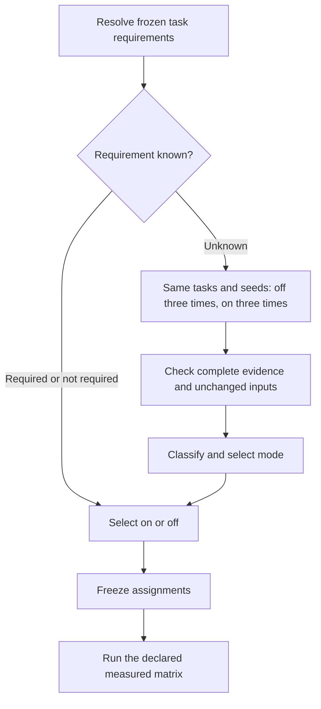

# Moli layout selection

Layout is page geometry and hit testing, not an instruction to continuously render every page. Resource fetching remains controlled separately by `launch_profile`.

## Run modes

| `--moli-layout` | Behavior |
| --- | --- |
| `off` (default) | Disable layout for every task. No qualification calls. |
| `on` | Enable layout for every task. No qualification calls. |
| `auto` | Use each task's requirement. Qualify unknown requirements before the measured run, then freeze the selected mode. |

Both `runner/run.py run` and `tools/run_moli_cohort.py` default to `off`. Pass `on` explicitly to reproduce an all-layout cohort. `auto` is a distinct execution policy, not a reinterpretation of an existing off/on score.

## Three-state requirements

Every enabled task has an entry in `config/moli_layout_requirements.json`. Keeping annotations separate preserves the frozen task files and historical task hashes.

| `requirement` | Meaning | Auto behavior |
| --- | --- | --- |
| `required` | A recognized mandatory geometry operation, or stable off-fail/on-pass evidence for this exact binary and task | Enable layout |
| `not_required` | A completely recognized layout-independent contract, or stable off-pass evidence for the unchanged task | Disable layout |
| `unknown` | Unclassified, changed, unstable, or unsuccessful in both modes | Run paired qualification |

Explicit coordinate mouse/touch input, coordinate hit testing, box geometry and real screenshot/print operations establish a layout dependency. An optional probe does not establish a requirement for the whole task. A framework name, `click` label, or arbitrary JavaScript string does not establish its actual execution path. Such contracts remain unknown unless qualified. The selector never replaces coordinate input with DOM activation.

Empirical annotations bind the complete task SHA-256 and Moli binary SHA-256. Their scope is acceptance under that specific task contract, not a claim that a driver or website never needs layout. An engine upgrade retains `not_required` when the unchanged task has passed with layout off. The original engine and evidence hashes remain recorded; this reuse chooses the execution mode and does not claim a pass on the new engine. Newer paired evidence that demonstrates off-fail/on-pass takes precedence over historical off success. Other empirical labels remain binary-scoped; independently recognized geometry operations can still establish a requirement. A task change makes the old annotation unknown. `list --kind tasks --json` exposes annotations; full `validate` rejects missing, extra or stale task entries. `tools/update_moli_layout_requirements.py --write` regenerates new/changed entries without dropping valid existing evidence labels.

## Unknown-task qualification

Qualification uses only controlled `about_blank` or `self_hosted_fixture` scenes. Each mode gets a fresh fixture server; each physical attempt starts a fresh Moli process. Both modes use the same frozen tasks, seeds, driver and grader, one worker, and three attempts per task. If `--seed` is omitted, auto generates and records one seed before either mode runs. Engine, source, fixture, manifest, registry and task hashes are checked before and after qualification. No network error string is treated as proof of layout dependence; the ordinary task evaluator decides acceptance.

- All three off attempts pass: `not_required`, use off.
- All three off attempts fail and all three on attempts pass: `required`, use on.
- Both fail, either side is unstable, or infrastructure evidence is present: retain `unknown`.
- For an unresolved task, use the mode with more passing attempts; ties use off. This is a provisional execution choice, not a confirmed requirement.

Interrupted or incomplete qualification fails closed and preserves its evidence. No partial matrix supplies a confirmed label. A missing method that fails in both modes remains unresolved.

The qualification directory contains a frozen protocol, complete off/on runs, artifact hashes, `qualification.json`, and an updated `requirements.json`. Reuse the latter with `--moli-layout-requirements PATH`. Entries that remain unknown will be compared again on the next auto run. The checked-in registry is never silently edited by a benchmark execution.

The formal run records policy `task_layout_v4`, the selected assignments and their hash, and the qualification receipt reference. Each result records the actual launch flag. Qualification has six physical calls per unknown task; these and their accumulated driver duration are retained separately in the manifest and score summary. They never add tasks or attempts to the formal matrix. A successful qualification does not guarantee that a later formal attempt passes; the formal score uses only its own results.

`--dry-run` shows assignments and the number of additional qualification calls without starting browsers. Historical `contract_layout_v1` and `contract_layout_v2` receipts retain their original meanings.

Historical off-pass annotations are imported from the checksum-verified `evidence-four_engine_full_20260812.tar.gz` release asset. They require all three Moli attempts to pass, no fallback, launch commands without layout, and matching task ID, task version, driver, grader, scene and feature declarations. Historical and current task hashes are both retained because published task prose has changed; historical reuse supplies a mode-selection baseline, not current-version test results. Original versions and evidence hashes are retained in each annotation.

Rebuild these annotations with `python tools/import_moli_layout_history.py /path/to/evidence-four_engine_full_20260812.tar.gz`. The importer checks the published archive checksum and preserves newer confirmed paired decisions.
